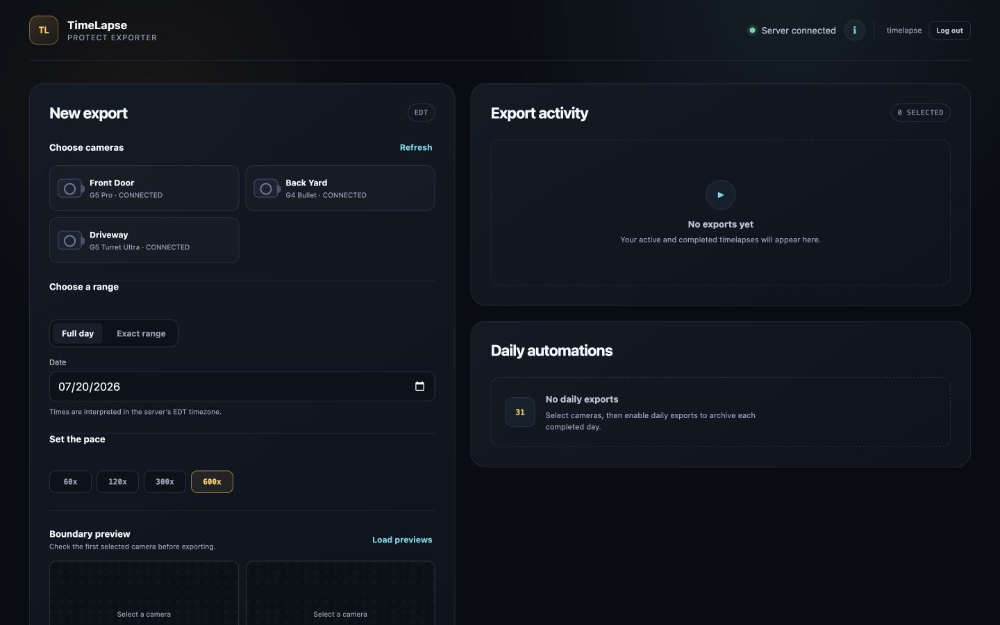
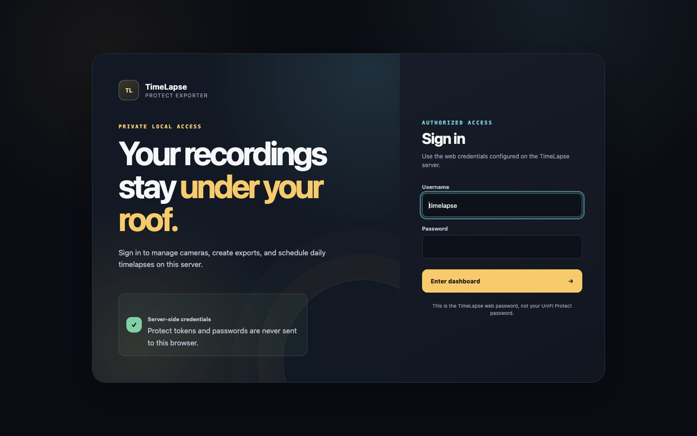
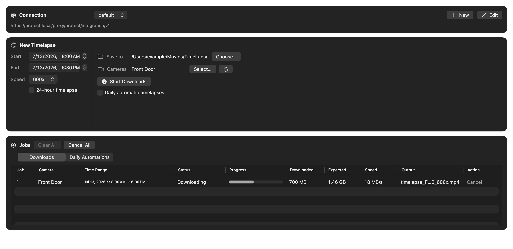
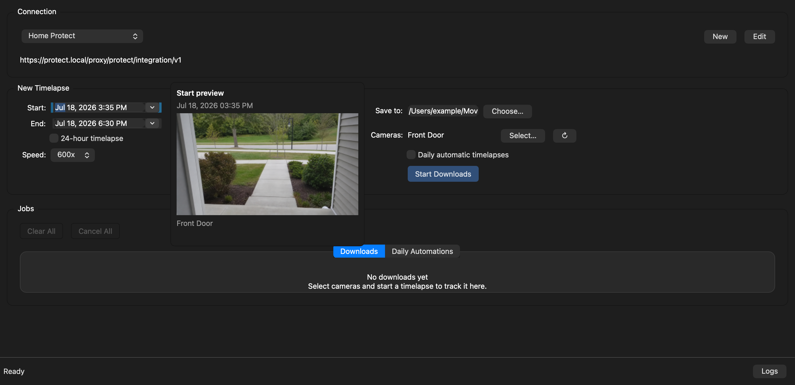

# UniFi Protect TimeLapse

Create MP4 timelapses from UniFi Protect recordings with an interactive command-line tool, native macOS and Windows apps, or a cross-platform Qt desktop interface.

The exporter lists the cameras available through the UniFi Protect Integration API, lets you select what to export, and streams the finished video to disk. It supports exact time ranges, complete local calendar days, and continuously scheduled daily exports.

> This is an independent project and is not affiliated with or endorsed by Ubiquiti Inc.

## Features

- Interactive camera discovery and selection
- Native SwiftUI interface for macOS
- Native WPF interface for Windows
- Cross-platform Qt desktop interface built with PySide6
- CLI speeds of `60x`, `120x`, `300x`, and `600x`
- Exact date/time ranges or daylight-saving-aware local calendar days
- Daily automatic exports for the most recently completed day
- Multiple concurrent per-camera jobs in the desktop interfaces
- Desktop notifications when downloads complete, fail, or are interrupted
- Job tables show the requested start and end date/time for every timelapse
- Automatic start/end thumbnail previews with exact-time and live-snapshot fallback
- Streaming downloads with progress, cancellation, and atomic finalization
- Safe output filenames and protection against overwriting existing videos
- Configurable whole-operation timeout and maximum download size
- Reusable CLI connection profiles stored in the operating system credential store
- OS credential-store integration in the desktop interfaces

## Requirements

- Python 3.11 or newer and [`uv`](https://docs.astral.sh/uv/) when running from source
- A reachable UniFi Protect console; trusted self-signed certificates are supported
- A Protect Integration API token for camera discovery and live-snapshot fallback
- A dedicated local Protect user with the device permissions listed below

Packaged desktop applications include their Python runtime. Building the native macOS app additionally requires macOS 15 and the Swift/Xcode command-line toolchain; building the native Windows app requires Windows and the .NET 8 SDK.

### Protect authentication and permissions

TimeLapse uses two Protect authentication paths:

- The **Integration API token** lists cameras and supplies the current live snapshot if an exact historical thumbnail cannot be retrieved.
- The **local Protect username and password** authenticate private recording exports and exact historical thumbnails. Use a dedicated local account, not a UI.com SSO or owner account.

For thumbnails and exports to work as intended, create a custom role for the local account with these **Device Permissions**:

| Permission | Required for |
| --- | --- |
| **All devices**, or **Specify** with every camera TimeLapse may use | Access to the selected cameras |
| **Livestream** | Exact historical thumbnails (`readmedia` / `livestream`) |
| **Playback** | Access to recorded footage |
| **Playback Download** | MP4 timelapse exports |

TimeLapse does not require Livestream Audio, Playback Audio, PTZ Control, Delete Footage, Edit Device Settings, Remove Device, or the Alarm Manager, Find Anything, and Case Manager application permissions. Grant any additional permissions only if that account needs them for another purpose.

## Quick start

Clone the repository and install the dependencies:

```bash
git clone https://github.com/nithjino/unifi-protect-timelapse.git
cd unifi-protect-timelapse
uv sync
```

Create your local configuration file:

```bash
cp .env.example .env
```

Edit `.env` with your Protect URL, API token, and local-user credentials:

```dotenv
UNIFI_PROTECT_URL=https://protect.local/proxy/protect/integration/v1
UNIFI_PROTECT_TOKEN=replace-with-your-integration-api-token
UNIFI_PROTECT_USERNAME=timelapse-user
UNIFI_PROTECT_PASSWORD=replace-with-your-local-user-password
UNIFI_PROTECT_VERIFY_SSL=true

TIMELAPSE_REQUEST_TIMEOUT_SECONDS=0
TIMELAPSE_MAX_DOWNLOAD_MIB=10240
```

Run a full-day export. The CLI will list available cameras and ask you to select one by number:

```bash
uv run timelapse --start-date 07-13-2026
```

## Configuration

The CLI reads `.env` from the current working directory. Explicit command-line arguments take precedence over environment-backed defaults, and existing process environment variables take precedence over values in `.env`.

When `.env` exists, it is the automatic connection source and the CLI prompts for any required connection value that
is missing. To use `--profile NAME`, remove or rename `.env`; without `.env`, provide either a profile or all required
connection values explicitly.

| Variable | Required | Default | Purpose |
| --- | --- | --- | --- |
| `UNIFI_PROTECT_URL` | Yes | — | Protect Integration API URL, normally ending in `/proxy/protect/integration/v1` |
| `UNIFI_PROTECT_TOKEN` | Yes | — | Integration API token used to list cameras and retrieve fallback live snapshots |
| `UNIFI_PROTECT_USERNAME` | Yes | — | Dedicated local Protect username used for exports and exact historical thumbnails |
| `UNIFI_PROTECT_PASSWORD` | Yes | — | Password for the dedicated local Protect user |
| `UNIFI_PROTECT_VERIFY_SSL` | No | `true` | Whether to verify the Protect console's TLS certificate |
| `TIMELAPSE_OUTPUT` | No | Generated filename | Output MP4 path, or output directory in daily mode |
| `TIMELAPSE_REQUEST_TIMEOUT_SECONDS` | No | `0` | Whole-operation deadline in seconds; `0` disables the deadline |
| `TIMELAPSE_MAX_DOWNLOAD_MIB` | No | `10240` | Maximum download size in MiB; `0` disables the limit |

Speed and date boundaries are intentionally CLI-only. They are not loaded from `.env`.

## CLI usage

Display every available option:

```bash
uv run timelapse --help
```

### Create and use a connection profile

Create a profile interactively. The CLI requires you to enter a profile name; it does not generate or select a
default name:

```bash
uv run timelapse --create-profile
```

When `.env` exists, the flow imports its connection values and asks only for anything missing. It always asks for the
profile name and never supplies a default. Without `.env`, it asks for the Protect URL, Integration API token, local
Protect username and password, and whether TLS certificates should be verified. Connection details are stored in the
operating system credential store. Profile names are case-sensitive, and an existing profile is not silently
overwritten.

Use the saved connection details by passing the profile name alongside the normal export options:

```bash
uv run timelapse --profile home --start-date 07-13-2026
```

An explicitly supplied connection flag overrides the corresponding profile value for that invocation. A named profile
can be selected only when `.env` is not present in the current working directory.

### Export one complete local day

A date without a time covers that local calendar day from midnight to midnight, including daylight-saving transitions:

```bash
uv run timelapse \
  --start-date 07-13-2026 \
  --speed 600x \
  --output ./back-yard-2026-07-13.mp4
```

`--end-date 07-13-2026` works the same way when it is the only boundary provided.

### Export an exact time range

Use `MM-DD-YYYY-HH-MM-SS` for precise local timestamps:

```bash
uv run timelapse \
  --start-date 07-13-2026-08-00-00 \
  --end-date 07-13-2026-18-30-00 \
  --speed 120x \
  --output ./daylight-hours.mp4
```

If only one timestamp boundary is supplied, the CLI exports a 24-hour range beginning at the start boundary or ending at the end boundary.

### Run continuous daily exports

Daily mode first exports the latest completed local day, then remains running and exports each day after the next local midnight:

```bash
uv run timelapse \
  --daily \
  --speed 600x \
  --output ./daily-timelapses
```

If a daily output already exists, it is skipped. The scheduler stores a small checkpoint in the output directory and
retries a failed day up to five times with capped exponential backoff. For unattended use, run the command under a
service manager so it restarts after the retry limit is reached. Stop the scheduler with `Ctrl+C`.

### Override connection settings

Every required connection value can be supplied directly. Be aware that command-line passwords may be stored in shell history or exposed to local process-inspection tools:

```bash
uv run timelapse \
  --instance https://protect.local/proxy/protect/integration/v1 \
  --token YOUR_INTEGRATION_TOKEN \
  --username timelapse-user \
  --password YOUR_LOCAL_USER_PASSWORD \
  --start-date 07-13-2026
```

### Adjust export safeguards

The whole-operation deadline covers authentication, retries, and response streaming. It is disabled by default so
long-running exports can finish. The default maximum download size is 10 GiB:

```bash
uv run timelapse \
  --start-date 07-13-2026 \
  --request-timeout-seconds 3600 \
  --max-download-mib 2048
```

Set either safeguard to `0` to disable it:

```bash
uv run timelapse \
  --start-date 07-13-2026 \
  --request-timeout-seconds 0 \
  --max-download-mib 0
```

The package can also be launched through Python's module interface:

```bash
uv run python -m timelapse --start-date 07-13-2026
```

## Web UI

The web interface runs the existing exporter as a central FastAPI service, so phones, tablets, and other computers can
use TimeLapse without installing the application. Protect credentials stay on the server and are never included in web
pages or API responses. The browser interface supports camera discovery, exact or full-day ranges, boundary previews,
concurrent exports, live progress, cancellation, retry, downloads, and persistent daily schedules.



### Run without Docker

Copy and complete the environment file, then launch the server:

```bash
cp .env.example .env
./start-web.sh
```

Open `http://127.0.0.1:8000`. The script installs locked dependencies with `uv` and starts Uvicorn. It listens only on
the local machine by default.

To use the interface from other devices on the same trusted network, add these values to `.env`, choosing a strong,
unique password:

```dotenv
TIMELAPSE_WEB_HOST=0.0.0.0
TIMELAPSE_WEB_TRUSTED_HOSTS=timelapse-server,timelapse-server.local,192.168.2.17
TIMELAPSE_WEB_USERNAME=timelapse
TIMELAPSE_WEB_PASSWORD=replace-with-a-long-random-password
```

`TIMELAPSE_WEB_TRUSTED_HOSTS` lists the server addresses that may appear in the browser URL; it does not list the IP
addresses of computers, phones, or other clients connecting to the server. For example, browsing to
`http://thinkpad:8000` requires `thinkpad`, while browsing to `http://192.168.2.17:8000` requires `192.168.2.17`.
Include every hostname or IP address you actually use, separated by commas, and omit the port. Restart the server after
changing the setting. TimeLapse refuses to start on a non-loopback address without an application password and rejects
request hosts outside this allowlist with `Untrusted host`. The browser shows a dedicated login page and creates an
HTTP-only, same-site session after a successful sign-in. This password protects the web interface; it is separate from
the Protect account password.



Sessions last seven days by default. Change `TIMELAPSE_WEB_SESSION_HOURS` to use a different duration. When an HTTPS
reverse proxy is terminating TLS for TimeLapse, set `TIMELAPSE_WEB_COOKIE_SECURE=true` so browsers send the session
cookie only over HTTPS.

Exports are stored in `./data/exports` by default. The export list is stored in `./data/web-jobs.json`, so completed,
failed, and cancelled entries return after a server restart. An export interrupted by shutdown returns as cancelled and
can be retried. Daily schedules are stored in `./data/web-schedules.json` and resume when the server restarts. Run one
Uvicorn worker because export and schedule state is maintained by this process.

Web exports default to 4 active jobs, 20 queued jobs, a 7-day requested range, and 100 GiB of aggregate export storage.
Adjust `TIMELAPSE_WEB_MAX_ACTIVE_EXPORTS`, `TIMELAPSE_WEB_MAX_QUEUED_EXPORTS`,
`TIMELAPSE_WEB_MAX_EXPORT_HOURS`, and `TIMELAPSE_WEB_STORAGE_QUOTA_MIB` to fit the server. Daily schedules use capped
exponential retry delays and pause after five consecutive failures; the dashboard shows the error and a manual Retry
action.

### Run with Docker Compose

Complete `.env`, including `TIMELAPSE_WEB_PASSWORD` and `TIMELAPSE_WEB_TRUSTED_HOSTS`, then run:

```bash
docker compose up --build -d
```

The Compose service publishes port `8000` for local-network access and mounts `./data` for exported videos, export
history, and schedule state. Change `TIMELAPSE_WEB_BIND_ADDRESS` to `127.0.0.1` if the container should be reachable only
from its host.

After changing `.env`, recreate the container so Compose loads the new environment values:

```bash
docker compose up -d --force-recreate timelapse-web
```

`docker compose restart` restarts the existing container without reloading `.env`.

Stop the service without deleting exports or schedules:

```bash
docker compose down
```

Do not expose this service directly to the public internet. For remote access, place it behind a trusted VPN or a
TLS-enabled reverse proxy with its own access controls.

## Native macOS GUI

The macOS interface is built with SwiftUI and uses the Python exporter as an embedded helper. It supports reusable connection profiles, multi-camera exports, full-day mode, daily automations, automatic thumbnail previews, requested time ranges in the job list, per-download progress, cancellation, restart actions, and a separate logs window. Credentials are stored in the macOS login Keychain.

Closing the macOS window leaves active downloads running. Quitting the app while downloads are active asks for confirmation before interrupting them.



Build and launch the native app on macOS:

```bash
./build-macos.sh
open dist/macos/timelapse.app
```

The build requires macOS 15 or newer, the Swift/Xcode command-line toolchain, and `uv`; its isolated backend environment uses Python 3.13 by default. Without `MACOS_SIGN_IDENTITY`, the script applies an ad-hoc signature suitable for local development. Set `MACOS_SIGN_IDENTITY` and, optionally, `MACOS_NOTARY_PROFILE` when producing a distributable build.

## Cross-platform Qt GUI (macOS, Linux, and Windows)

The PySide6 interface—often referred to as the PyQt GUI—runs on macOS, Linux, and Windows. macOS and Windows also have native interfaces. The Qt interface provides connection profiles, camera selection, exact or 24-hour ranges, automatic thumbnail previews, requested time ranges in the job list, multiple download jobs, daily automations, progress reporting, cancellation, and logs. Secrets are stored through `keyring` in the macOS Keychain, Windows Credential Manager, or the Linux desktop Secret Service.

The Linux Qt interface asks for confirmation before quitting while downloads are active.



Run it directly from a source checkout:

```bash
uv run timelapse-gui
```

Build the bundled Linux application on Linux:

```bash
./build-linux.sh
```

The Linux build is written to `dist/linux/`. Build on the oldest Linux distribution you intend to support for the widest glibc compatibility.

## Native Windows GUI

The Windows interface is built with WPF and uses the same embedded Python export backend as the native macOS application. It supports connection profiles, multi-camera exports, exact or 24-hour ranges, daily automations, automatic thumbnail previews, requested time ranges in the job list, download progress, cancellation, restart actions, and a separate logs window. Credentials are stored in Windows Credential Manager.

The native Windows interface asks for confirmation before quitting while downloads are active.

Build it from PowerShell on Windows with the .NET 8 SDK and `uv` installed:

```powershell
.\build-windows.ps1
```

The build produces one self-contained `win-x64` distributable at `dist\windows\timelapse.exe`. Set `TIMELAPSE_WINDOWS_RUNTIME` before building to target another Windows runtime identifier. The recipient does not need to install Python or .NET.

## Desktop thumbnail previews

The native macOS, native Windows, and Qt interfaces share the same preview behavior:

- Selecting or changing a start or end date/time immediately starts a background thumbnail request. Hovering over that field only displays the current loading, image, or error state; it does not initiate another request.
- A result or failure is cached for that camera and timestamp. Repeated hovers reuse it until the selected camera, connection profile, date, or time changes.
- When multiple cameras are selected, the preview uses the first selected camera and identifies it in the popover.
- A 24-hour timelapse previews `12:00 AM` on both the start date and end date.
- TimeLapse first requests the exact historical frame through the private Protect API using the local account. If that fails, it requests the camera's current live snapshot through the Integration API token and labels the preview **Live snapshot — selected time unavailable**.
- If both requests fail, the interface explains that the local account needs **Livestream** permission and the Integration API token needs access to the camera.

## Date and output behavior

- Accepted dates are `MM-DD-YYYY` and `MM-DD-YYYY-HH-MM-SS`.
- All CLI dates are interpreted in the computer's local timezone.
- A date-only boundary exports one complete local calendar day.
- Two timestamp boundaries export their exact range.
- `--daily` cannot be combined with `--start-date` or `--end-date`.
- Without `--output`, filenames include the camera name, start, end, and selected speed.
- Normal filenames follow `timelapse_<camera>_<start>_<end>_<speed>.mp4`.
- Daily filenames use the same format with a `daily_` prefix.
- Existing output files are never overwritten.
- Downloads are written to a temporary `.part` file and atomically renamed only after success.

## Security notes

- Use a dedicated local Protect account with only Livestream, Playback, Playback Download, and access to the cameras TimeLapse may use.
- The Integration API token is used for camera discovery and fallback live snapshots. Private video exports and exact historical thumbnails use the local username and password.
- Keep TLS verification enabled unless you are connecting to a trusted local console with a self-signed certificate.
- `.env` is ignored by Git, but it is still a plaintext file. Restrict its filesystem permissions and never commit it.
- CLI profiles keep their connection details in the operating system credential store.
- The desktop interfaces store connection secrets in the platform credential store instead of application preferences.
- The web interface reads Protect credentials only from the server environment. LAN access requires a separate web
  password, and the Docker configuration requires this password before it starts.
- Export error bodies are size-limited and escaped before they are printed to a terminal.

## Troubleshooting

### Camera listing works, but export returns `HTTP 401` with `{"error":403}`

The Integration API token can list cameras but does not authenticate the private video-export endpoint. Confirm that `UNIFI_PROTECT_USERNAME` and `UNIFI_PROTECT_PASSWORD` belong to a local Protect user assigned to that camera with Playback and Playback Download permissions.

### A thumbnail is labeled as a live snapshot

The exact historical request failed, so TimeLapse used the Integration API token to retrieve the camera's current image. Assign the local Protect account to that camera and enable Livestream permission to retrieve the frame at the selected time. Playback and Playback Download are still required for exports.

### A thumbnail cannot be loaded

If both thumbnail paths fail, check both credentials:

- The local account must be assigned to the camera and have Livestream permission for the exact historical image.
- The Integration API token must be valid and able to access that camera for the live fallback.

After correcting access, change the selected date or time to retry. A time with no retained recording can still fall back to the current live snapshot.

### Protect login returns `HTTP 429`

Protect is rate-limiting local-account authentication. Wait for the console's rate-limit window to clear and avoid running multiple copies of TimeLapse with the same account. Thumbnail requests are started when a date/time is selected and cached for that camera and timestamp; merely hovering over the date/time does not start another request.

### TLS certificate verification fails

Use a valid certificate whenever possible. For a trusted console on a private network with a self-signed certificate, set:

```dotenv
UNIFI_PROTECT_VERIFY_SSL=false
```

You can override it for one CLI invocation as well:

```bash
uv run timelapse --verify-ssl false --start-date 07-13-2026
```

### No cameras are returned

Check the Protect URL, confirm that it uses HTTPS, and verify that the Integration API token can read the console's cameras.

### A long export stops early

Leave `TIMELAPSE_REQUEST_TIMEOUT_SECONDS=0` for no operation deadline, or pass a larger positive value. Also check `TIMELAPSE_MAX_DOWNLOAD_MIB` if the export is unusually large.

### Daily mode appears idle

After catching up through the latest completed day, daily mode waits until the current local day ends. The CLI or desktop application must remain running for the next export.

## Development

Install the runtime and development dependencies:

```bash
uv sync --group dev
```

Run the Python quality checks:

```bash
uv run ruff check .
uv run ruff format --check .
uv run pyright
uv run pytest -q
```

Run the native macOS tests on macOS:

```bash
swift test --package-path native-macos
```

Build-check the native Windows project with the .NET 8 SDK:

```bash
dotnet build native-windows/TimeLapseNative.csproj -p:EnableWindowsTargeting=true
```

The full packaged Windows build must be run on Windows with `build-windows.ps1`.

The main source areas are:

| Path | Responsibility |
| --- | --- |
| `timelapse/config.py` | CLI parsing, `.env` loading, validation, and date ranges |
| `timelapse/profiles.py` | Secure storage and loading for named CLI connection profiles |
| `timelapse/protect.py` | Protect URL parsing, authentication, and camera discovery |
| `timelapse/download.py` | Streaming downloads, output naming, progress, and limits |
| `timelapse/schedule.py` | Local calendar-day and daily scheduling helpers |
| `timelapse/service.py` | UI-neutral camera discovery, thumbnail, and export orchestration |
| `timelapse/cli.py` | Interactive CLI workflow |
| `timelapse/gui.py` | Qt desktop interface |
| `timelapse/native_backend.py` | JSON-lines bridge used by native desktop shells |
| `timelapse/web.py` | FastAPI routes, authentication, HTML responses, and Uvicorn entry point |
| `timelapse/web_state.py` | Web export jobs, live progress, and persistent daily schedules |
| `native-macos/` | Native SwiftUI macOS application |
| `native-windows/` | Native WPF Windows application |
| `tests/` | Python unit and GUI tests |
