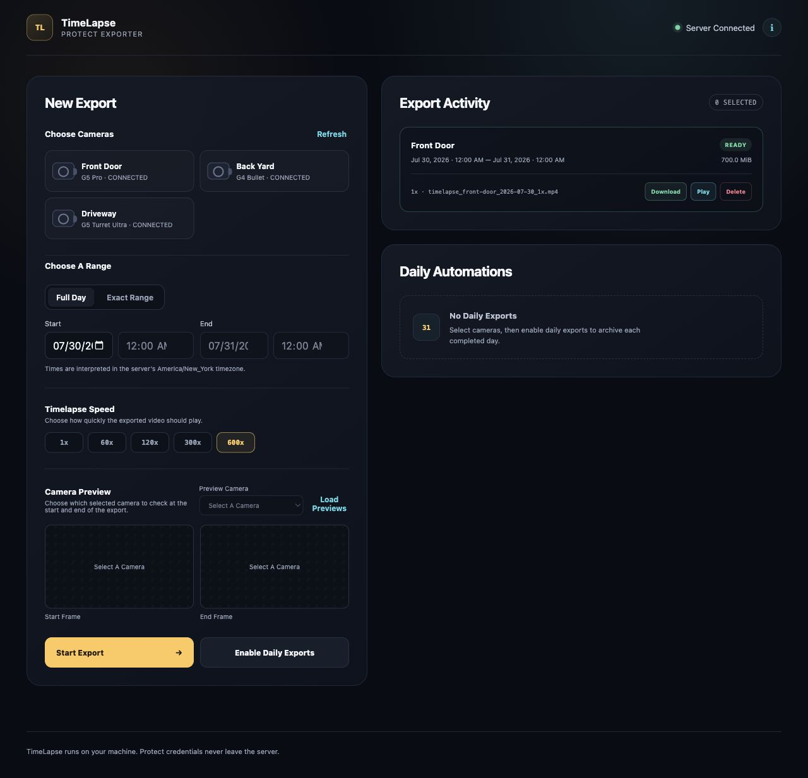
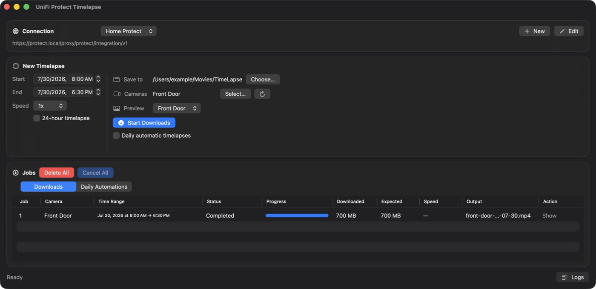
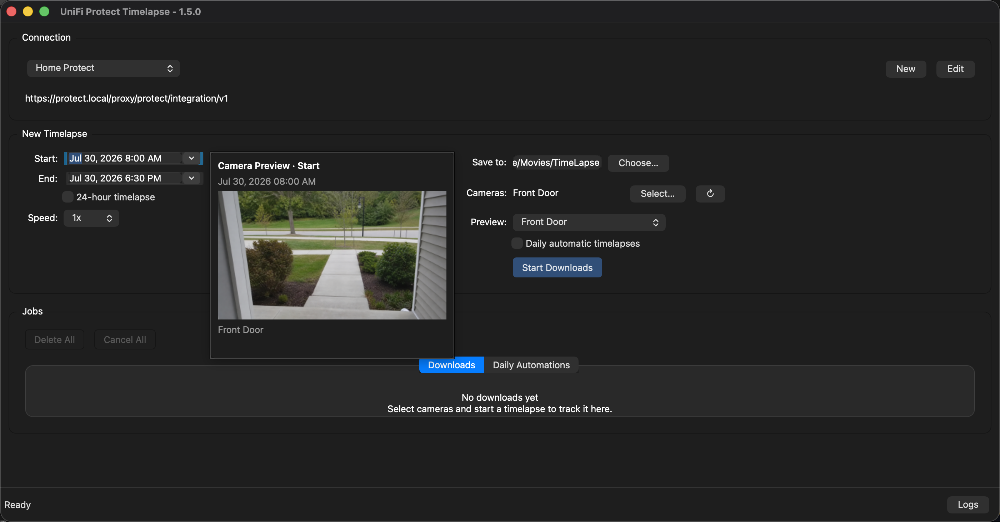
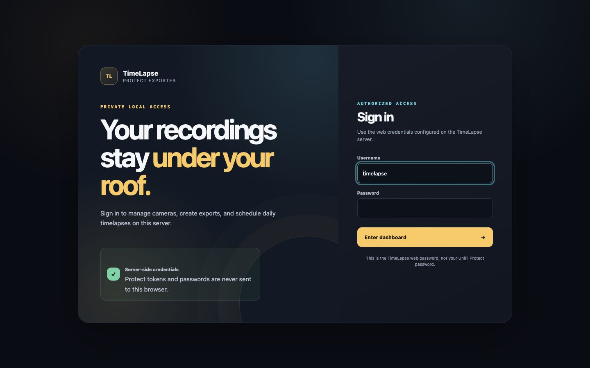

# UniFi Protect TimeLapse

Export UniFi Protect recordings as MP4 timelapses from the CLI, a desktop app, or a local web dashboard.



TimeLapse supports exact ranges, full local calendar days, and recurring daily exports. Downloads stream directly to disk and can be cancelled without leaving a partial video behind.

> Independent project. Not affiliated with or endorsed by Ubiquiti Inc.

## Highlights

- Native macOS and Windows apps
- Cross-platform Qt app for macOS, Linux, and Windows
- Local web dashboard for phones and other computers
- Multi-camera exports with progress, retry, cancellation, and notifications
- Speeds from normal playback (`1x`) through `600x`
- Start and end thumbnail previews
- Daily automatic exports
- Credentials stored in the OS credential store

## Requirements

- Python 3.11+ and [`uv`](https://docs.astral.sh/uv/) when running from source
- A reachable UniFi Protect console
- A Protect Integration API token
- A dedicated local Protect user

Packaged desktop builds include Python.

## Protect access

TimeLapse uses both Protect authentication methods:

- The **Integration API token** lists cameras and provides fallback live snapshots.
- The **local username and password** export recordings and fetch historical thumbnails.

Give the local user access to each camera plus these device permissions:

| Permission | Used for |
| --- | --- |
| Livestream | Historical thumbnails |
| Playback | Recorded footage |
| Playback Download | MP4 exports |

Use a dedicated local account, not a UI.com SSO or owner account.

## Quick start

```bash
git clone https://github.com/nithjino/unifi-protect-timelapse.git
cd unifi-protect-timelapse
uv sync
cp .env.example .env
```

Add your Protect details to `.env`:

```dotenv
UNIFI_PROTECT_URL=https://protect.local/proxy/protect/integration/v1
UNIFI_PROTECT_TOKEN=replace-with-your-integration-api-token
UNIFI_PROTECT_USERNAME=timelapse-user
UNIFI_PROTECT_PASSWORD=replace-with-your-local-user-password
UNIFI_PROTECT_VERIFY_SSL=true
```

Export one full day:

```bash
uv run timelapse --start-date 07-30-2026
```

TimeLapse lists the available cameras and asks which one to use.

## CLI

See every option:

```bash
uv run timelapse --help
```

Exact time range:

```bash
uv run timelapse \
  --start-date 07-30-2026-08-00-00 \
  --end-date 07-30-2026-18-30-00 \
  --speed 120x
```

Daily exports:

```bash
uv run timelapse --daily --speed 600x --output ./daily-timelapses
```

Create and use a saved connection profile:

```bash
uv run timelapse --create-profile
uv run timelapse --profile home --start-date 07-30-2026
```

Profiles are used when `.env` is not present. They are case-sensitive and stored in the OS credential store.

Accepted date formats are `MM-DD-YYYY` and `MM-DD-YYYY-HH-MM-SS`. A date by itself means one complete local calendar day.

## macOS app



Build and open the native SwiftUI app:

```bash
./build-macos.sh
open dist/macos/timelapse.app
```

Requires macOS 15+, `uv`, and the Swift/Xcode command-line tools. Set `MACOS_SIGN_IDENTITY` when building for distribution; local builds use an ad-hoc signature.

## Qt desktop app



Run from source:

```bash
uv run timelapse-gui
```

Build the Linux executable and AppImage:

```bash
./build-linux.sh
```

The Qt app runs on macOS, Linux, and Windows. Secrets are stored through `keyring` in Keychain, Windows Credential Manager, or Secret Service.

## Windows app

Build the native WPF app from PowerShell with .NET 8 and `uv` installed:

```powershell
.\build-windows.ps1
```

The self-contained build is written to `dist\windows\timelapse.exe`.

## Web dashboard

Run locally:

```bash
./start-web.sh
```

Then open `http://127.0.0.1:8000`.

For access from another device, set a strong web password and list every hostname or IP address used in the browser URL:

```dotenv
TZ=America/New_York
TIMELAPSE_WEB_HOST=0.0.0.0
TIMELAPSE_WEB_TRUSTED_HOSTS=timelapse-server.local,192.168.2.17
TIMELAPSE_WEB_USERNAME=timelapse
TIMELAPSE_WEB_PASSWORD=replace-with-a-long-random-password
```



Docker Compose works too:

```bash
mkdir -p data
docker compose up --build -d
```

Exports, job history, and daily schedules live in `./data`. Recreate the container after changing `.env`:

```bash
docker compose up -d --force-recreate timelapse-web
```

Keep the web app on a trusted LAN, behind a VPN, or behind an HTTPS reverse proxy. Do not expose it directly to the internet.

## Useful settings

| Variable | Default | Purpose |
| --- | --- | --- |
| `TIMELAPSE_OUTPUT` | Generated filename | Output file or daily output directory |
| `TIMELAPSE_REQUEST_TIMEOUT_SECONDS` | `0` | Whole-operation timeout; `0` disables it |
| `TIMELAPSE_MAX_DOWNLOAD_MIB` | `10240` | Maximum export size; `0` disables it |
| `TIMELAPSE_WEB_SESSION_HOURS` | `168` | Web session length |
| `TIMELAPSE_WEB_MAX_ACTIVE_EXPORTS` | `4` | Concurrent web exports |
| `TIMELAPSE_WEB_MAX_QUEUED_EXPORTS` | `20` | Queued web exports |
| `TIMELAPSE_WEB_STORAGE_QUOTA_MIB` | `102400` | Total web export storage |

Existing files are never overwritten. Downloads use a temporary `.part` file and are renamed only after they finish.

## Troubleshooting

- **Camera listing works, but exports return 401/403:** check the local username, password, camera access, Playback, and Playback Download permissions.
- **A preview uses a live snapshot:** the local user could not fetch the historical frame. Check camera access and Livestream permission.
- **Protect returns HTTP 429:** let the built-in retry queue work and avoid starting more copies of TimeLapse.
- **TLS verification fails:** use a valid certificate when possible. For a trusted private console with a self-signed certificate, set `UNIFI_PROTECT_VERIFY_SSL=false`.

## Development

```bash
uv sync --group dev
uv run ruff check .
uv run ruff format --check .
uv run pyright
uv run pytest -q
```

Native checks:

```bash
swift test --package-path native-macos
dotnet build native-windows/TimeLapseNative.csproj -p:EnableWindowsTargeting=true
```
